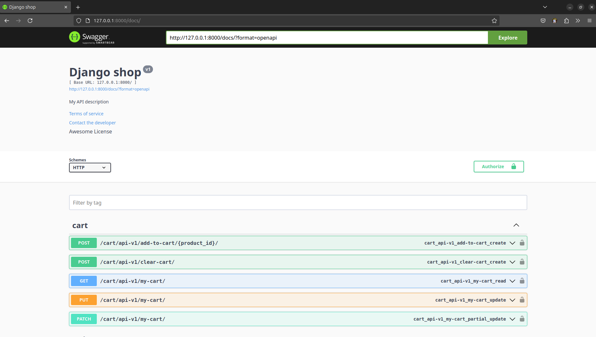

# 🛒 Django Online Shop API

A robust and scalable e-commerce backend built with Django and Django REST Framework.  
This API facilitates the management of products, users, carts, orders, and payments, providing a solid foundation for any online shopping platform.

## 📸 Screenshots

- **Swagger UI Overview**  
  

- **Cart, Payments, Orders Endpoints**  
  

- **Products and Users Endpoints**  
  

---

## 🚀 Features

- **Product Management** – CRUD operations for products with rich details  
- **User Authentication** – Secure registration, JWT-based login, and profile management  
- **Shopping Cart** – Add, update, and remove items  
- **Order Processing** – Place orders and view order history  
- **Payment Integration** – Simulated payment handling  
- **Interactive Documentation** – Swagger UI via drf-yasg  
- **custom middlewares** – Auto authentication middleware for development and IP blocker middleware
---

## 🧱 Tech Stack

- **Framework**: Django, Django REST Framework  
- **Database**: PostgreSQL  
- **Docs**: Swagger UI  
- **Auth**: JWT  
- **Containerization**: Docker & Docker Compose  
- **Testing**: pytest  

---

## 🛠 Installation

### Prerequisites

- Python 3.8+
- Docker & Docker Compose

### Steps

1. **Clone the repository**
   ```bash
   git clone https://github.com/HosseinSiw/Django-Online-shop-API.git
   cd Django-Online-shop-API

2. **Set up environment variables**
    Create a .env file based on .env.example and set the required values (e.g. PostgreSQL credentials).

3. Run the docker
    ```bash
    docker compose up --build

4. Create a superuser
    ```bash
    docker exec -it django python manage.py createsuperuser

5. Explore the API docs
    Go to http://localhost:8000/docs/ for interactive swagger API exploration.


### 🔗 API Endpoints (Sample)

#### 🔐 Auth

    POST    users/api-v1/register/ – Register new user

    POST    users/api-v1/login/    – Obtain JWT tokens
    POST    users/api/jwt/refresh/ – Refresh the Token
    
    GET     users/api-v1/profile/  – Get user profile
    PATCH   users/api-v1/profile/  – Update the profile

#### 🛍️ Products

    GET products/api-v1/products/  – Get the products (pagination and caching mechanism)

    GET/PUT/DELETE products/api-v1/products/<slug>/  – Get the product detailes (GET only for non-admin users)
    
#### 🛒 Cart

    GET cart/api-v1/add-to-cart/<product_id>/ – Add to cart

    POST cart/api-v1/clear-cart/ – clear the users cart

    GET/PUT/PATCH cart/api-v1/my-cart/ – Retrive and update the cart

#### 📦 Orders

    POST orders/api-v1/create-orders/ – Create an order based on the cart contents.

    GET orders/api-v1/orders/ – List of the orders (pagination)

    GET orders/api-v1/orders/<order_id>/ – Details of an order.

    POST orders/api-v1/set-order-as-paid/<order_id>/ – Set an order as paid, this endpoint is only for development environments.

#### 💳 Payments

    POST payments/api-v1/request/ – Request a payment to ZarinPal (direct from the cart contents). 

    GET payments/api-v1/verify/  – Verify a payment (Zarinpal).

    POST payments/api-v2/order-payment-request/<order_uuid> – Request to pay an order
    GET  payments/api-v2/order-payment-verify/ – Verify a payment.

### 📂 Project Structure
├── cart/               # Cart management
├── orders/             # Order processing
├── payments/           # Payment handling
├── products/           # Product catalog
├── users/              # Authentication & user profiles
├── templates/          # Email templates
├── locust/             # Load testing setup
├── root/               # Main Django project config
├── Dockerfile
├── docker-compose.yml
├── requirements.txt
└── manage.py


### 📧 Contact

Created and maintained by HosseinSiw
Feel free to open issues or submit pull requests!


